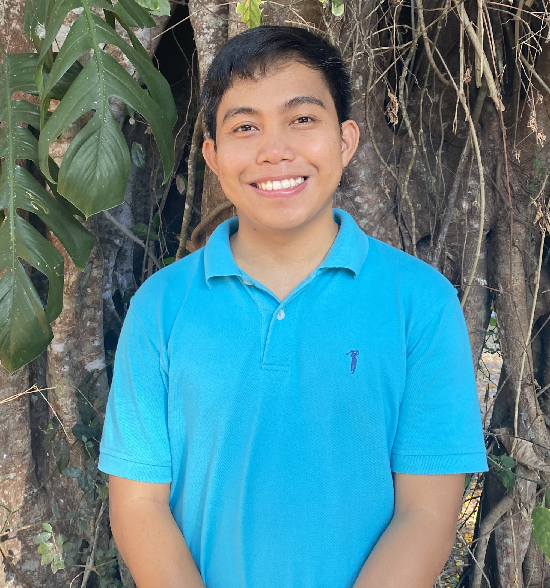
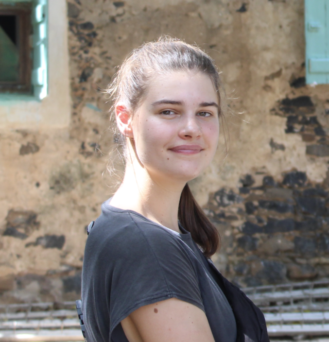
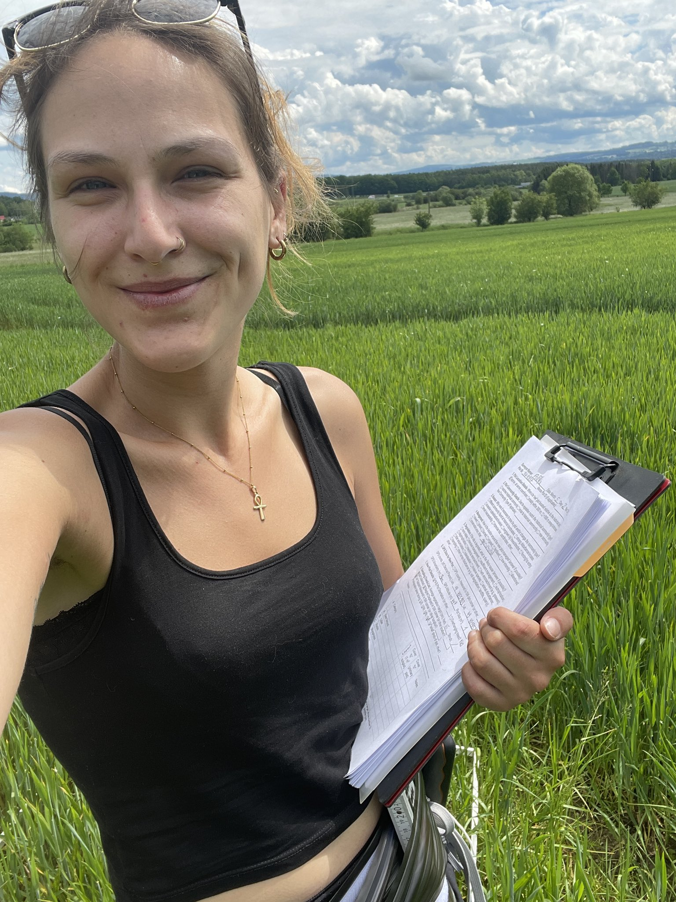
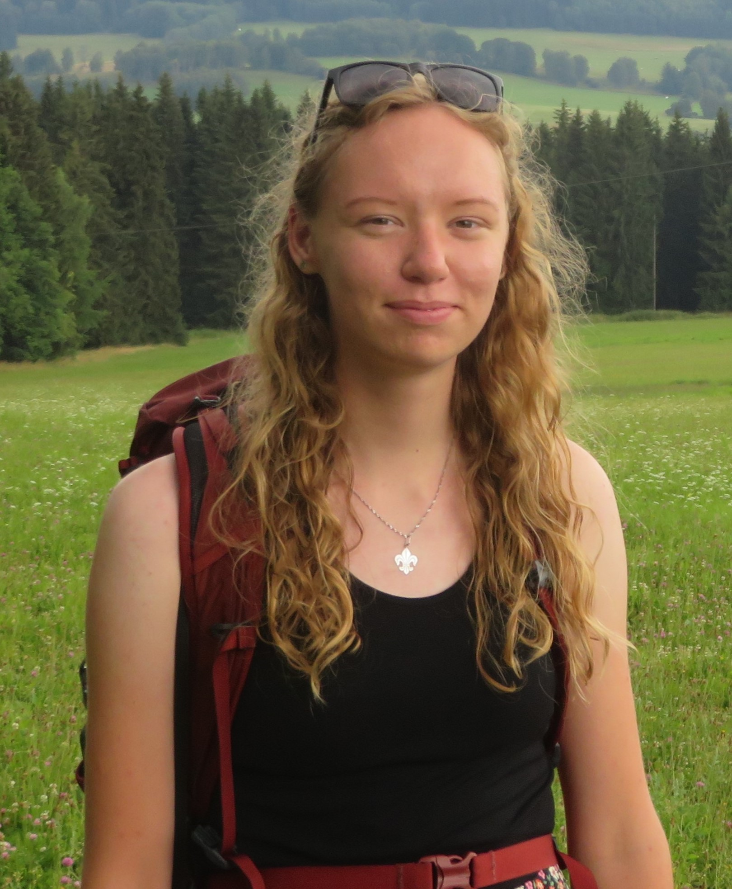

## People

-   

    ### [Ondřej Mottl](https://ondrejmottl.github.io/about_me/cv.html) 

    -   **Head of the Laboratory**
    -   Assistant Professor for Plant Ecology
    -   📬email: ondrej.mottl(at)gmail.com
    -   
    -   [About me](https://ondrejmottl.github.io/about_me/cv.html)
    -   [List of publications](https://ondrejmottl.github.io/about_me/list_of_publications.html)

-   

    ### Bryan Novio 

    -   PhD student
    -   📬email: noviobryan(at)gmail.com
    -   
    -   [*Holocene Diversity Trends*](https://ondrejmottl.github.io/projects/HoloceneDiversityTrends/) project
    -   joined Autumn 2024

-   

    ### Natálie Námešná 

-   

    -   PhD student
    -   📬email: hanusova.nat(at)gmail.com
    -   [*Functional Vegetation Paleoecology*](https://ondrejmottl.github.io/projects/FunctionalVegetationPaleoecology/) project
    -   joined Autumn 2025

### Former members

-   

    ### Friederike Wolke 

    -   Technical assistant (programming)
    -   📬email: friederike.woelke(at)gmail.com
    -   [*RRatepol*](https://ondrejmottl.github.io/projects/RRatepol/) R-Package development
    -   Employed summer and autumn 2025

-   

    ### Markéta Tumová 

    -   Bc student
    -   📬email: tumovamarket(at)natur.cuni.cz
    -   *Alpine Biodiversity Across Continents* project (linked to the [PPF Alpine](https://ondrejmottl.github.io/projects/PPF-Alpine/))
    -   joined in Autumn 2024
    -   Finished Bc thesis in Spring 2025
